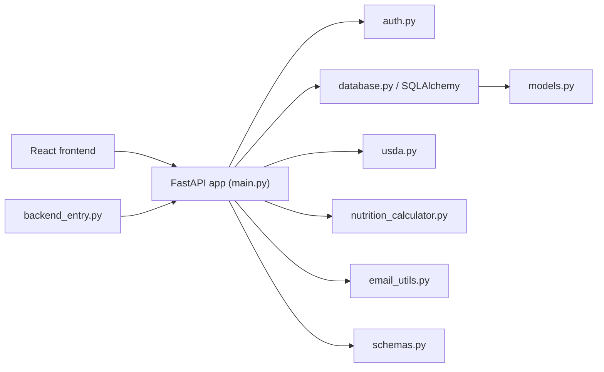

# PakuPaku Architecture

This document is a practical map of how the codebase is wired together.

## High-Level Diagram

## Backend Request Flow

Most authenticated requests work like this:

1. The browser sends a request with a bearer token.
2. FastAPI routes in `main.py` depend on `get_current_user()` from `auth.py`.
3. `auth.py` decodes the JWT, loads the user from the database, and returns the ORM model.
4. The route handler reads or mutates SQLAlchemy objects.
5. `database.get_db()` commits automatically after the route returns successfully.

This design keeps most route bodies focused on business logic instead of transaction handling.

## Core Backend Files

### `main.py`

The main application module. It:

- creates the FastAPI app
- applies CORS middleware
- defines route handlers
- coordinates auth, USDA lookups, calculators, and database access

This is the best place to start when you want to understand product behavior.

### `auth.py`

Provides:

- `hash_password()`
- `verify_password()`
- `create_access_token()`
- `decode_access_token()`
- `get_current_user()`

It is the bridge between the `Authorization` header and a loaded `User` ORM object.

### `database.py`

Provides:

- the async SQLAlchemy engine
- the async session factory
- the declarative `Base`
- `get_db()` request dependency

`get_db()` is important because it owns commit/rollback behavior for almost every request.

### `models.py`

Defines the persistent data model:

- `User`
- `FoodLog`
- `Recipe`
- `RecipeIngredient`
- `BodyMeasurement`

Relationships are defined here, not in the route layer.

### `schemas.py`

Defines request and response contracts for FastAPI. It is the place to update when:

- adding new request fields
- changing response payload shape
- tightening validation

### `nutrition_calculator.py`

Contains the onboarding and nutrition math:

- body-fat estimation
- BMR/TDEE calculation
- goal adjustment
- macro targets
- metabolic condition adjustments

Routes in `main.py` call this module and persist the resulting values onto the user profile.

### `usda.py`

Wraps USDA FoodData Central HTTP calls and extracts nutrient values into a flatter shape that the app can use more easily.

Responsibilities include:

- validating USDA request inputs
- adding the API key
- translating HTTP failures into FastAPI `HTTPException`s
- normalizing nutrient/portion data

### `email_utils.py`

Builds and sends verification emails. The route layer only decides when to send an email; formatting and SMTP details live here.

### `backend_entry.py`

Used by desktop packaging. It:

- determines the desktop data directory
- persists a local `SECRET_KEY`
- points the backend at the packaged database location
- starts the FastAPI app through Uvicorn on a free localhost port

## Main Data Model

### User

The `User` model stores both identity and product state:

- auth fields: email, username, password hash
- verification fields: `email_verified`, `verification_token`
- onboarding data: weight, height, age, hormonal and body-shape inputs
- derived nutrition values: BMR, TDEE, macro targets
- user preferences: `safe_mode`

This means the user row acts as both an account record and a cached nutrition profile.

### Food Logs

`FoodLog` stores daily food entries with nutrient values frozen at log time. That avoids drift if USDA data changes later.

### Recipes

Recipes are user-owned collections of ingredients. Per-serving totals are calculated in the API layer and cached on the `Recipe` row.

### Body Measurements

Body measurements are historical snapshots used for progress tracking and optional body-fat estimation.

## Frontend Structure

The frontend entry point is `pakupaku-frontend/src/App.tsx`.

Important folders/files:

- `src/components/`: screen-level UI such as `Login`, `Onboarding`, `Dashboard`, `RecipeBuilder`, `Settings`
- `src/services/api.ts`: local/mobile-oriented data access facade
- `src/services/auth.ts`: local SQLite-backed auth/session handling
- `src/services/db.ts`: Capacitor SQLite setup
- `src/services/nutritionCalculator.ts`: frontend-side calculation helpers

One important nuance: the frontend is in a transitional state. Some parts talk to the FastAPI backend with `fetch()`, while others use the service layer designed around local SQLite/mobile storage.

## Common Change Paths

### Add a new backend field

1. Add the column in `models.py`
2. Expose it in the relevant schema in `schemas.py`
3. Read/write it in `main.py`
4. Update the frontend UI that consumes it

### Add a new authenticated endpoint

1. Create the route in `main.py`
2. Add or reuse a schema in `schemas.py`
3. Depend on `get_current_user()`
4. Use `db: AsyncSession = Depends(get_db)`

### Change onboarding math

1. Update `nutrition_calculator.py`
2. Check `main.py` onboarding routes for persisted fields and warnings
3. Update frontend onboarding copy if the user-facing explanation changes

### Change email verification behavior

1. Update `email_utils.py` for message contents or URLs
2. Update `main.py` auth routes for verification logic
3. Update `pakupaku-frontend/src/App.tsx` for verification-state UX

## Known Design Tension

The largest architectural tension in the repo is the split between:

- server-backed web flows
- local SQLite/mobile service flows

That split is important to know before making broad changes, because a feature may need to be updated in two places to keep behavior aligned.
